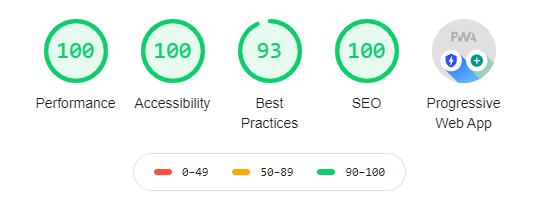

# gatsby-starter-typescript-minimal

An opinionated [Gatsby](https://www.gatsbyjs.org/) starter, built using [TypeScript](https://www.typescriptlang.org/) and [Styled Components](https://styled-components.com/). A PWA with full SEO capabilities, making no assumption on the styling you want to apply. 

## Features

- TypeScript
- ESLint (with standard ESLint rules)
- Basic component structure
- SEO with Helmet and config driven defaults
- Styling with Styled Components
- Progressive Web App implementation
- Clean Google lighthouse reports
  
  Many Gatsby starters have Google Lighthouse issues, these have been resolved with minimal code & light plugin footprint. Below is the Lighthouse report on a local machine (the only issues relate to the lack of HTTPS on localhost)
  
  
  Incorporate the sources and deployment model you want. 
  

## Built With

- [Gatsby V2](https://www.gatsbyjs.org/)
- [TypeScript](https://www.typescriptlang.org/)
  
